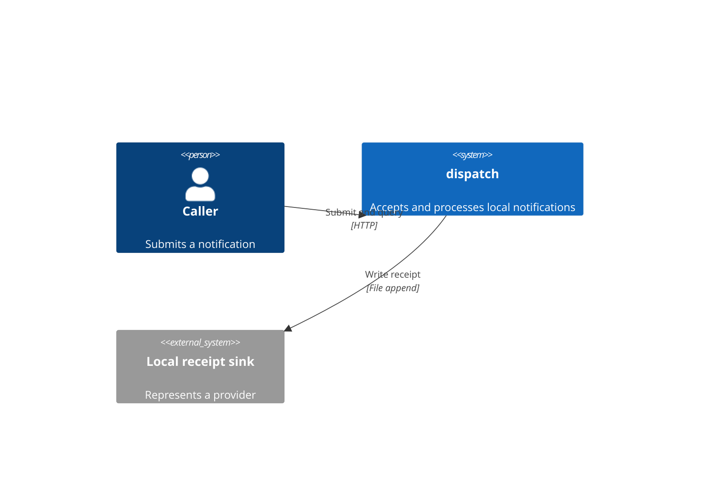
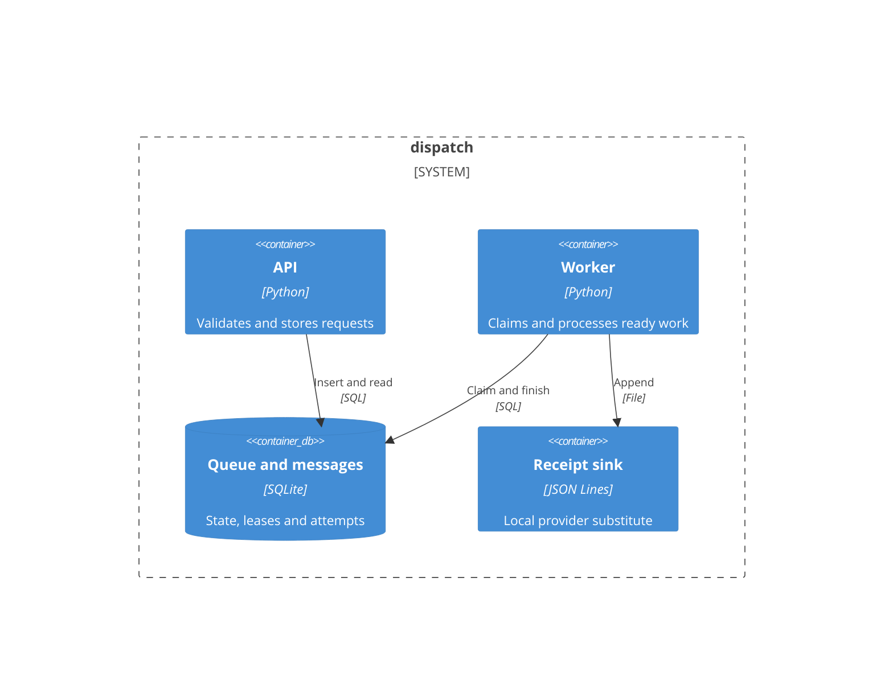
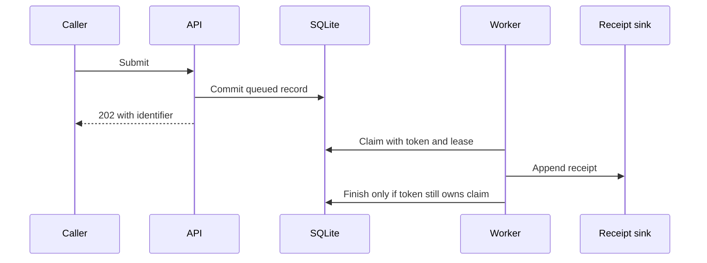

# Architecture

## Context and scope

A caller submits notifications; the local fixture persists requests and writes delivery receipts instead of contacting external vendors.

## Solution strategy

Acceptance and delivery are separate. Returning 202 after a database commit avoids blocking the caller on provider behavior. The cost is a state machine and delayed completion.

SQLite replaces the earlier fictional cloud queue for this executable example. It eliminates service installation and credentials, but does not demonstrate a distributed broker. [ADR 0003](../adr/0003-executable-local-example.md) records this change without erasing earlier decisions.

## Building blocks

## Runtime view

## Crosscutting concepts

Claims use an immediate SQLite transaction. A lease expires after 30 seconds; a stale worker cannot overwrite a newer claim token. The receipt side effect can still repeat, so this is not exactly-once delivery. The public sample contains no real recipient data.
