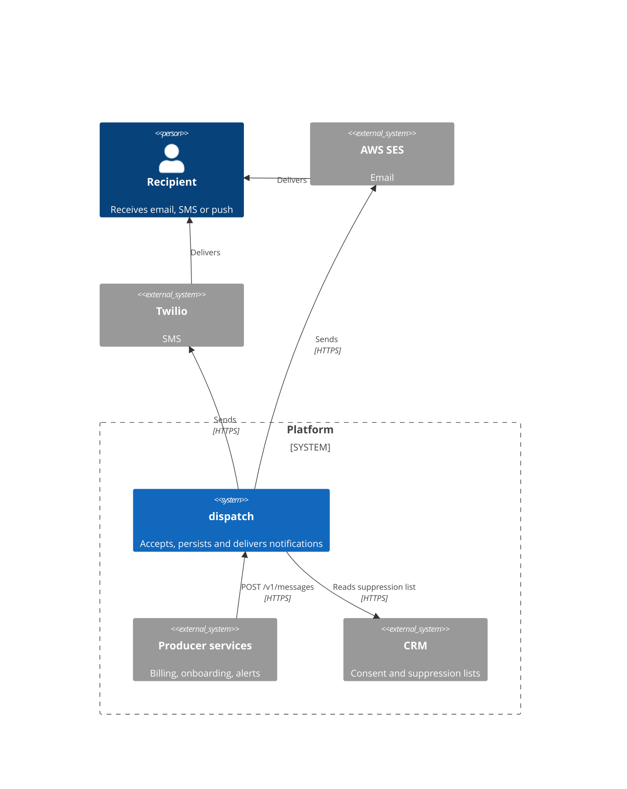
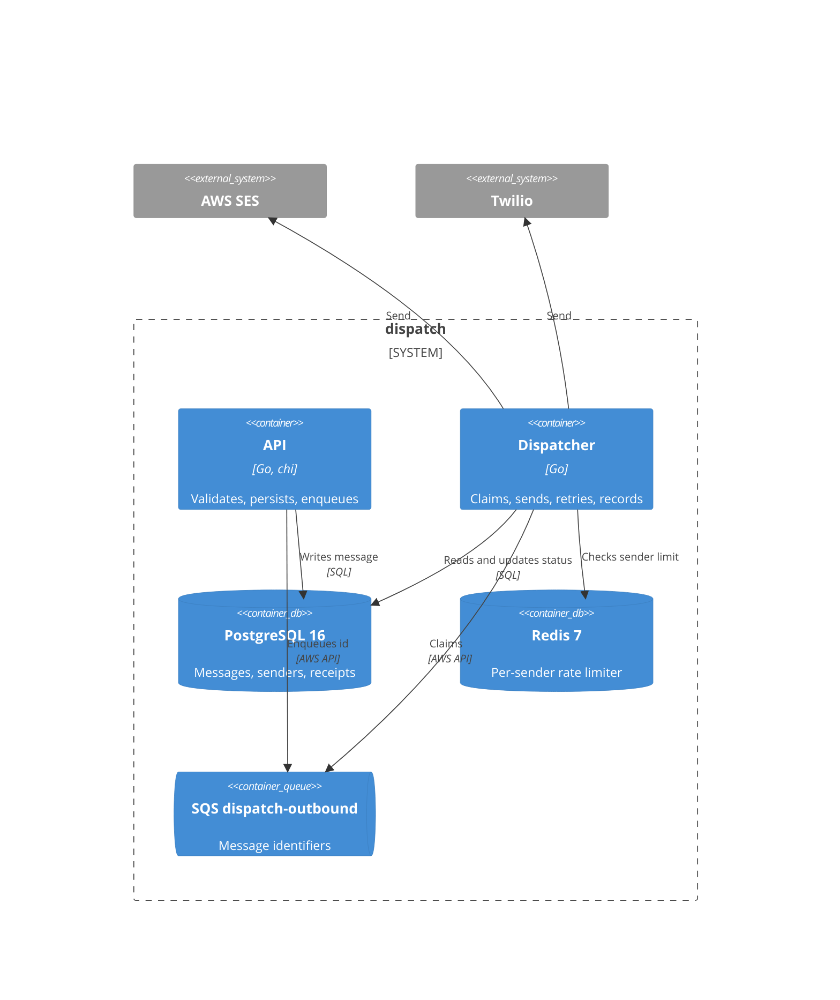

# Architecture

arc42 subset: context and scope, solution strategy, building blocks, runtime view, crosscutting concerns.

## Context and scope

dispatch sits between internal producers and external delivery vendors. It owns the message record and the retry decision. It does not own recipient consent, which stays in the CRM, and it does not own templates, which each producer renders before calling.

## Solution strategy

Three decisions shape everything else.

**Accepting and delivering are separated.** The API writes a row and enqueues an identifier; the dispatcher does the delivery. A producer's call succeeds while every vendor is down, which is the behaviour producers need — a billing run must not fail because SES is throttling.

The cost is that "accepted" and "delivered" are different states a caller has to reason about, and support questions of the form "did it send?" need a lookup rather than a response code. We took that cost deliberately.

**The queue holds identifiers, not payloads.** The database is the source of truth for message content. A redelivery re-reads the current row rather than replaying a stale copy, so a correction applied between attempts takes effect. It costs one database read per attempt.

**Provider errors are classified, not retried blindly.** Each provider maps vendor errors to retryable or permanent. Blind retry on a permanent error burns the attempt budget and delays every message behind it; blind failure on a transient error loses messages that would have gone out.

## Building blocks

Both binaries build from the same module. `make run` starts them in one process for local work; production runs them as separate deployments so the API scales on request rate and the dispatcher on queue depth.

## Runtime view

A normal send: API validates against the sender record, writes `notifications` with status `queued`, enqueues the id, returns 202. The dispatcher claims the id, re-reads the row, checks the suppression list and the rate limiter, calls the provider, writes `sent` with the receipt. On a retryable error it writes `queued` with an incremented attempt count and lets the visibility timeout redeliver. On a permanent error it writes `failed` with `last_error` and deletes the queue message.

After five receives SQS moves the message to the DLQ. Nothing automatically drains the DLQ; that is a human decision, described in [the queue depth runbook](../runbooks/dispatch-queue-depth-critical.md).

## Crosscutting concerns

**Time.** Stored and compared in UTC, `timestamptz` columns.

**Configuration.** Read once at startup. See [configuration](../reference/configuration.md), which also lists the constraints between keys.

**Observability.** Traces to OTLP when configured. The two metrics that matter operationally are queue depth and per-provider error rate; both have alerts and both have runbooks.

**What we rejected.** Kafka, in [ADR 0001](../adr/0001-sqs-over-kafka.md). Exactly-once delivery, in [ADR 0002](../adr/0002-at-least-once-delivery.md). Rendering templates inside dispatch, because it would put every producer's content model into this service's release cycle.
