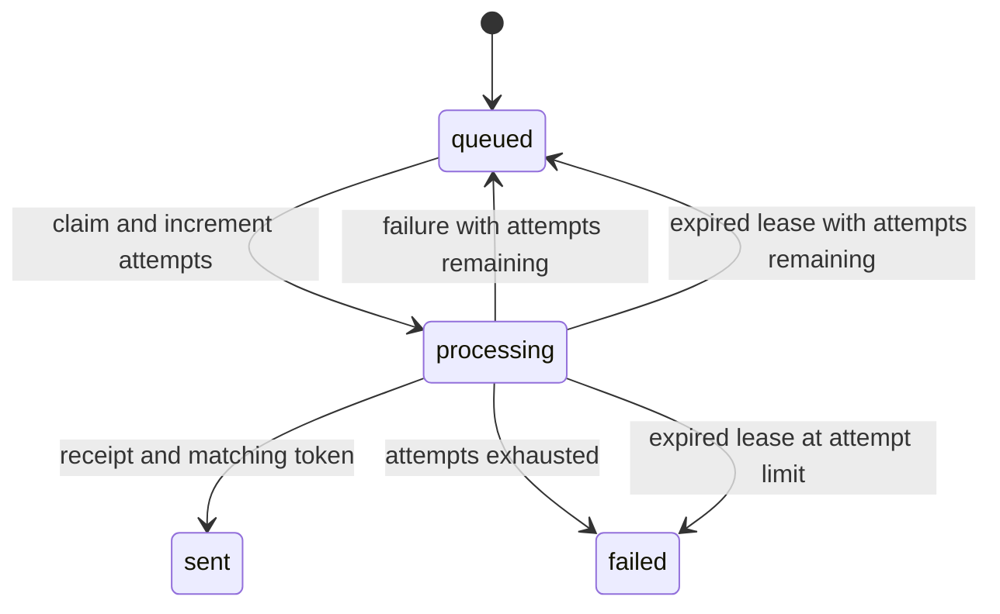

# Data model

The messages table also acts as a single-host queue. UUIDs identify requests. Rows contain channel, recipient, body, status, attempts, earliest available time, lease expiry, claim token and last error.

Separating queue and messages into two stores would resemble a production service but require cross-store reconciliation. One database is sufficient for a runnable teaching fixture, at the cost of single-host write contention.
