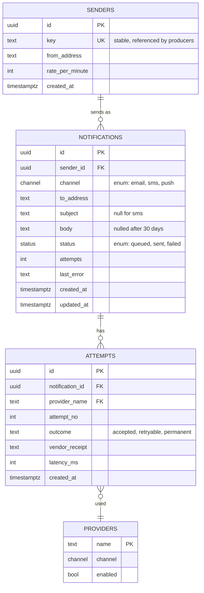
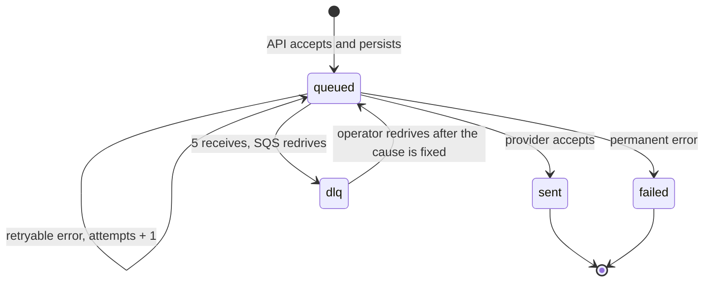

# Data model

Four tables. The message row is the source of truth for content and state; the queue only carries identifiers, so a redelivery re-reads the current row rather than replaying a stale copy.

## Why attempts are a separate table

A counter on the message would answer "how many tries", which is all the retry logic needs. It would not answer "which provider failed, with what error, how slowly" — the question every incident asks. Keeping attempts as rows costs one insert per try and makes the provider error-rate metric a query rather than a log scrape.

The cost is table growth: attempts outnumber notifications, and nothing prunes them yet. That is a known gap.

## Message lifecycle

`status` moves in one direction only. There is no path back from `failed`; a message that must go out again is a new message, so the audit trail stays intact.

`dlq` is not a column. It is a queue location, shown here because operationally it is a state someone has to reason about, and the queue depth runbook treats it as one.

## Constraints worth knowing

- `senders.key` is the stable identifier producers reference. `senders.id` is internal and may change on a restore.
- `channel` is a Postgres enum. Values can be added and never removed, which makes adding a channel a one-way migration.
- Every timestamp is `timestamptz`, compared in UTC. A driver in local time produces retry storms at the DST boundary.
- `notifications.body` is nulled by a scheduled job at 30 days. The row survives for reporting.
