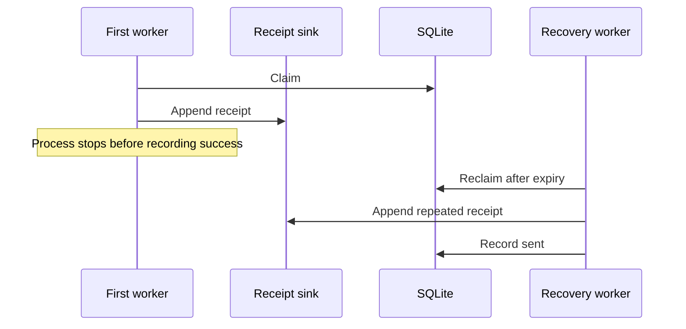

# Delivery semantics

A receipt can be appended immediately before a worker crashes. If success was not recorded, the lease eventually expires and another worker can append the same message identifier again.

Recording success before the append would avoid this duplicate window but lose accepted work when the process stops between those operations. The fixture chooses retryable processing and exposes stable identifiers, not guaranteed eventual delivery: three failures are terminal.

An expired worker's old token cannot update the newer claim. This protects queue state, not external exactly-once effects. [ADR 0003](../adr/0003-executable-local-example.md) defines the executable boundary.
